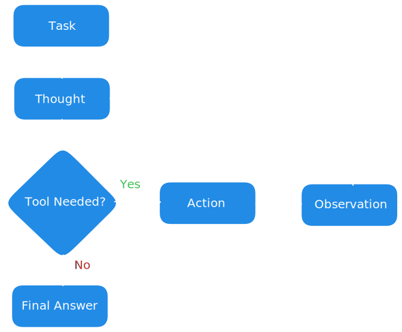

## ReAct + Plan-and-Execute — Minimal AI Agent Demo

This project is a simple demo showing how an AI agent can reason and interact with external tools.
It follows the ReAct (Reasoning + Acting) workflow and combines it with the Plan-and-Execute pattern to build an extendable agent framework.

## What is ReAct
Paper: https://arxiv.org/abs/2210.03629
 
ReAct is a framework that lets LLMs operate in a loop of:

- Thought — the model reasons about the next step
- Action — the model calls a tool or performs an operation
- Observation — the agent receives the tool result
- Final Answer — the agent concludes the task

This loop enables the model to interact with the outside world instead of only generating text.

 

  

## What is Plan-And-Execute
Reference: https://langchain-ai.github.io/langgraph/tutorials/plan-and-execute/plan-and-execute/

